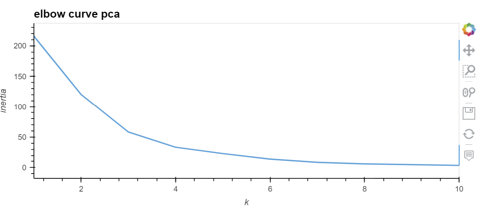

# Machine_Learning_Crypto_Analysis
This is an analysis that uses unsupervised learning to cluster cryptocurrencies by their performance in different periods.

---

## Technologies

This project leverages python 3.7 with the following packages:

* [pandas] (https://github.com/pandas-dev/pandas) - For data manipulation and analysis.

* [hvplot] (https://github.com/holoviz/hvplot) - For high-level plotting.

* [pathlib] (https://github.com/budlight/pathlib) - For importing cvs files using standarized file path notation.

* [sklearn] (https://github.com/scikit-learn/scikit-learn) - For machine learning.
---

## Datasets

Dataset pulled from Resources folder which contains csv files.

## Usage

### General

Upon launching the crypto_investments.ipynb run each cell sequentially, ensuring to import the required libraries.

### Cluster Cryptocurrencies Using Original Data

Your graphs should look like these.

### Cluster Cryptocurrencies Using PCA

Your graphs should look like this.

